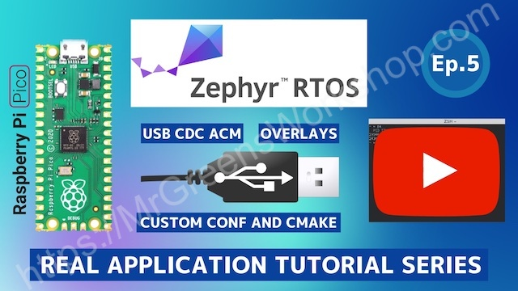

## Zephyr RTOS Tutorials with Raspberry Pi Pico

[](https://github.com/MrGreensWorkshop/ZephyrOS_RasPiPico_PicoDRO/issues)
[](https://github.com/MrGreensWorkshop/ZephyrOS_RasPiPico_PicoDRO/blob/main/README.md#readme)
[](https://github.com/MrGreensWorkshop/ZephyrOS_RasPiPico_PicoDRO/blob/main/README.md#readme)
[](https://github.com/MrGreensWorkshop/ZephyrOS_RasPiPico_PicoDRO/blob/main/LICENSE.txt)
[](https://github.com/sponsors/MrGreensWorkshop "Support me on GitHub Sponsors")
[](https://patreon.com/MrGreensWorkshop "Support me on Patreon")
[](https://ko-fi.com/MrGreensWorkshop "Tip me via Ko-fi")

---

<div align="center">
  <a href="https://youtu.be/t3nBOYfJrb8"></a>
</div>

Everything is covered in [the video above](https://youtu.be/t3nBOYfJrb8) and in this [blog post](https://www.mrgreensworkshop.com/posts/2023-03-24-raspberry-pi-pico-zephyr-rtos-picodro). Please watch all [Zephyr RTOS Tutorial videos](https://www.youtube.com/playlist?list=PLAymxPbYHgl-FZSggEx_lRJoPU2h4tT36) to make more sense of this one.

#### Build commands (tag-specific)

  The build command is the same for both application types. Run the commands below within the `ZephyrOS_RasPiPico_PicoDRO` directory. For more about west command, please check [the link](https://docs.zephyrproject.org/latest/develop/west/build-flash-debug.html).

  The default console is set to USB CDC.

  - Build the app

    ```shell
    west build app -p
    ```

  - Build the app with debug configuration (LOG output)

    ```shell
    west build app -p -- -DOVERLAY_CONFIG="debug.conf"
    ```

  - Build the app with UART configuration

    ```shell
    west build app -p -- -DUSE_USB_CONSOLE="OFF"
    ```

  - Build the app with UART & debug configuration (LOG output)

    ```shell
    west build app -p -- -DUSE_USB_CONSOLE="OFF" -DOVERLAY_CONFIG="debug.conf"
    ```

### You Can Support My Work

Creating projects like this takes a great amount of time. Much appreciated if you consider supporting me so that I can continue projects like this and creating new contents for everyone.

- You can support me on [GitHub Sponsors](https://github.com/sponsors/MrGreensWorkshop "Support me on GitHub Sponsors") (monthly or one time)
- You can be one of my patrons on [Patreon](https://patreon.com/MrGreensWorkshop "Be my Patron") (monthly)
- You can tip me via [Ko-fi](https://ko-fi.com/MrGreensWorkshop "Tip Me via Ko-fi") (one time)

### Something is not right?

Since this is source code for a tutorial, I disabled the Issues tab. If you truly believe something is wrong, you can express your concerns in [discussions](https://github.com/MrGreensWorkshop/ZephyrOS_RasPiPico_PicoDRO/discussions).

### License

As it says in the [Apache License 2.0](https://github.com/MrGreensWorkshop/ZephyrOS_RasPiPico_PicoDRO/blob/main/LICENSE.txt), you can use my code anywhere as long as you include the license file and copyright notice. Also, state if you make any changes.

`Copyright (c) 2022 Mr. Green's Workshop https://www.MrGreensWorkshop.com`
